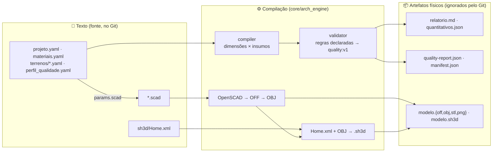

# arch-engine

**Declarative Physical-Design Stack** — *Docs as Code* aplicado a projeto,
engenharia e planejamento físico.

> Um projeto de edificação é texto: YAML descreve, Python cruza, OpenSCAD
> modela, Sweet Home 3D humaniza, o CI entrega. O Git vê o diff de tudo.

[](https://github.com/aretw0/arch-engine/actions/workflows/pipeline.yml)
[](LICENSE)

## A ideia

Ferramentas de projeto guardam decisões em binários que não se comparam nem se
revisam: um `.skp`, uma planilha, um PDF de memorial. O `arch-engine` inverte
isso. **Tudo que decide é texto puro** (YAML, OpenSCAD, XML, Markdown) e **tudo
que se vê é derivado** — relatório de custos e carbono, malha 3D, planta
humanizada — gerado por um pipeline que qualquer clone reproduz.



O **core é agnóstico**: não sabe o que é uma casa. Ele conhece *dimensões*,
*insumos*, *composições* (base geométrica × insumo) e *regras*. O domínio —
uma residência, um galpão, uma horta — vive em `examples/`.

## Veja funcionando em 2 minutos

```bash
git clone https://github.com/aretw0/arch-engine && cd arch-engine
uv sync
uv run arch-engine build examples/eco-house-demo
cat examples/eco-house-demo/artifacts/relatorio.md
```

O `build` cruza as dimensões da casa com o DB de insumos, calcula custo e
carbono incorporado, roda o linter de restrições e escreve os artefatos. Ele
**sai com código 1** se alguma regra `fail` disparar — o CI bloqueia o merge.

Para o CAD e o Sweet Home 3D (precisa de `openscad`; PNG em máquina sem
display precisa de `xvfb-run`):

```bash
scripts/cli_runner.sh all      # build → cad → sh3d → manifest
ls examples/eco-house-demo/cad/render/
```

👉 **[`examples/eco-house-demo/README.md`](examples/eco-house-demo/README.md)**
mostra a casa ecológica por dentro — e como quebrá-la de propósito.

## O que está no repositório

```
core/arch_engine/     ⚙️  o motor (agnóstico, testado sem a demo)
  loader.py             YAML → modelo, com erro que aponta arquivo e chave
  compiler.py           bases geométricas × composição → quantitativos, custo, CO₂e
  validator.py          perfil de regras (quality:v1) → findings; fail bloqueia
  contracts.py          envelopes quality:v1 / artifact:v1 / provenance:v1 (refarm)
  scad.py · mesh.py     params.scad em cm · OFF → OBJ (Z-up → Y-up)
  sh3d.py               Home.xml (template) + OBJ → .sh3d
  cli.py                build · validate · scad-params · off2obj · pack-sh3d · manifest
core/templates/       📐 base_container.scad (lote) · base_humanizer/Home.xml (SH3D)
examples/eco-house-demo/  🧪 casa ecológica: data/ cad/ engenharia/
scripts/              cli_runner.sh (OpenSCAD, SH3D) · vendor_refarm.mjs · test_refarm_contracts.mjs
docs/                 spec · ADRs · demandas ao ecossistema · referências
tests/                pytest: unidade em memória + ponta a ponta sobre a demo
.github/workflows/    lint → test → build → cad → (prova refarm, manual)
```

## Como o texto vira coisa

| Etapa | Entrada | Saída | Quem |
|---|---|---|---|
| **Compilar** | `data/projeto.yaml` + `data/materiais.yaml` + lote | `artifacts/relatorio.md`, `quantitativos.json` | `arch-engine build` |
| **Validar** | `data/perfil_qualidade.yaml` (regras declaradas) | `artifacts/quality-report.json` (`quality:v1`) | idem; `fail` → exit 1 |
| **Parametrizar o CAD** | as mesmas dimensões, em cm | `cad/gen/params.scad` | idem |
| **Modelar** | `cad/main.scad` (terreno em `%`, casa sólida) | `cad/render/modelo.{off,stl,png}` | OpenSCAD |
| **Converter** | OFF | OBJ (Y-up) | `arch-engine off2obj` |
| **Humanizar** | `cad/sh3d/Home.xml` + OBJ | `cad/render/modelo.sh3d` | `arch-engine pack-sh3d` |
| **Rastrear** | tudo acima | `artifacts/manifest.json` (`artifact:v1`, sha256 + provenance) | `arch-engine manifest` |

Nenhuma dessas saídas é versionada (`.gitignore`). O CI as publica como
artefatos do workflow e imprime o relatório no resumo do job.

## Por que esses formatos

- **YAML** com chaves em português: é a linguagem de quem projeta (`pe_direito`,
  `orcamento_limite`), e é diffável.
- **OpenSCAD**: CAD que é código. O terreno é um *container* no modificador
  `%` — transparente no preview e fora da exportação; mudar o lote não muda a
  casa, só onde ela cabe ([ADR-002](docs/adr/ADR-002-off-para-obj-em-python.md)
  explica o OFF → OBJ).
- **Sweet Home 3D como texto**: um `.sh3d` é um zip com `Home.xml`; versionamos
  o XML e geramos o zip ([ADR-003](docs/adr/ADR-003-sh3d-como-home-xml-versionado.md)).
- **Contratos do refarm**: o validador emite `quality:v1`, o build emite
  `artifact:v1` — em Python, provados em Node contra o pacote real
  ([ADR-004](docs/adr/ADR-004-contratos-do-refarm-emitidos-em-python.md)).

## Ecossistema

Este repositório é um consumidor do [`refarm`](https://github.com/aretw0/refarm)
(SDK de contratos local-first) e um par de `vault-seed`, `coop-vault` e `enem`.
O que ele usa, o que ele prova e o que ele pede estão em
[`docs/ECOSYSTEM-DEMANDS.md`](docs/ECOSYSTEM-DEMANDS.md). Para rodar a prova de
consumo localmente (precisa do checkout do refarm ao lado):

```bash
npm run vendor:refarm && npm install --no-package-lock
uv run arch-engine build examples/eco-house-demo && npm run test:refarm
```

## Estender

- **Nova base geométrica** (ex.: `area_fachada_norte`): uma função pura em
  `compiler.BASES`, um teste, e ela já pode ser usada em qualquer `composicao`.
- **Nova regra**: um `check.type` em `validator.CHECKS`; declara-se no
  `perfil_qualidade.yaml` de cada instância com a severidade que o projeto quiser.
- **Novo caso de uso**: copie a árvore de `examples/eco-house-demo/`, troque
  os dados, aponte `cad/` para os módulos do seu domínio.

## Documentação

[`docs/README.md`](docs/README.md) — spec de design, ADRs com fontes,
demandas ao ecossistema, referências verificáveis. Regras para contribuir
(humanas ou agentes): [`AGENTS.md`](AGENTS.md).

## Estado

v0.1 — o esqueleto completo do fluxo, com a demo passando de ponta a ponta.
O que ainda não foi verificado e o que vem depois está no
[README da demo](examples/eco-house-demo/README.md#checklist-de-verificação).
Landing page: baixa prioridade, via `@refarm.dev/ds` quando houver release.

## Licença

[AGPL-3.0](LICENSE).
