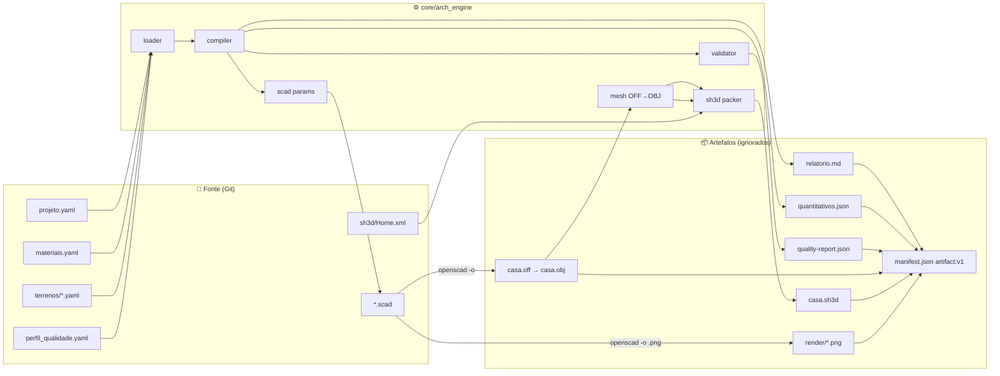

# arch-engine — design da stack declarativa de projeto físico

**Data:** 2026-08-29 · **Status:** aprovado para implementação (v0.1) · **Caminho:** arquitetural

## 1. Problema

Projetar uma edificação envolve três linguagens que hoje vivem em ferramentas
separadas e binárias: dimensões (CAD), insumos (planilhas) e critérios
(normas, saúde, orçamento). Cada decisão fica presa em um arquivo que o Git
não consegue diffar nem revisar.

O `arch-engine` aplica *Docs as Code* a esse fluxo: **tudo é texto puro,
versionável e compilável** — YAML descreve, Python cruza, OpenSCAD modela,
Sweet Home 3D humaniza, e o CI gera os artefatos.

## 2. Princípios

1. **Core agnóstico, dados em exemplos.** `core/` não conhece "casa",
   "terreno" ou "taipa". Ele conhece *dimensões*, *insumos*, *composições* e
   *regras*. Tudo que é domínio vive em `examples/<caso>/data/`.
2. **Fonte é texto; artefato é derivado.** `.obj`, `.stl`, `.png`, `.pdf`,
   `.sh3d` e relatórios são gerados e ignorados pelo Git. Um `.sh3d` é um
   zip: versionamos o `Home.xml` que vai dentro dele.
3. **Contratos antes de bibliotecas.** Os relatórios saem nos envelopes
   `quality:v1` e `artifact:v1` do refarm — emitidos nativamente em Python,
   provados em Node contra o tarball real. Ver [[ADR-004]].
4. **Rastro verificável.** Cada número de insumo (preço, CO₂, COV) carrega
   `provenance` (canal, link, data). Cada decisão técnica vira ADR com fonte.

## 3. Arquitetura



### 3.1 Módulos do core (`core/arch_engine/`)

| Módulo | Responsabilidade | Depende de |
|---|---|---|
| `model.py` | dataclasses puras: `Projeto`, `Lote`, `Material`, `ItemComposicao`, `Perfil`, `Regra` | — |
| `loader.py` | YAML → modelo, com erros de esquema legíveis (`SpecError`) | PyYAML |
| `compiler.py` | bases geométricas → quantitativos → custo/CO₂ por item e totais | `model` |
| `validator.py` | executa um `Perfil` (regras declaradas) sobre o resultado compilado e emite findings | `model`, `compiler` |
| `contracts.py` | envelopes `quality:v1`, `artifact:v1` e verificação `provenance:v1` (espelhos do refarm) | — |
| `report.py` | Markdown do relatório | `compiler` |
| `scad.py` | gera `gen/params.scad` a partir do projeto + lote | `model` |
| `mesh.py` | converte OFF (OpenSCAD estável) em OBJ (Sweet Home 3D) | — |
| `sh3d.py` | empacota `Home.xml` + `.obj` em `.sh3d` (zip) | — |
| `cli.py` | `arch-engine build|validate|scad-params|off2obj|pack-sh3d` | tudo acima |

Cada módulo é testável isoladamente (`tests/`), sem I/O além do necessário.

### 3.2 Modelo de dados (chaves em pt-BR, linguagem ubíqua do domínio)

`projeto.yaml` — o que se quer construir:

```yaml
schema: arch-engine.projeto.v1
nome: Casa Ecológica Demo
moeda: BRL
orcamento_limite: 180000
dimensoes:            # metros
  largura: 9.0
  profundidade: 12.0
  pe_direito: 3.0
  espessura_parede: 0.30
  aberturas_percentual: 0.15   # portas/janelas descontadas da área de parede
  inclinacao_cobertura_graus: 20
composicao:           # quais insumos entram, e sobre qual base geométrica
  - elemento: paredes externas
    material: taipa_de_pilao
    base: area_paredes_externas
    fator: 1.0
```

`materiais.yaml` — o DB de insumos, com metadados filtráveis:

```yaml
schema: arch-engine.materiais.v1
materiais:
  taipa_de_pilao:
    nome: Taipa de pilão
    unidade: m3
    preco_unitario: 350.0
    consumo_por_m2: 0.30
    saude: { vif: Isento, respirabilidade: Alta }
    ecologico: { pegada_carbono_kg_co2: 45.6, origem_local: true }
    provenance: { channel: literature, originLink: https://…, collectedAt: 2026-08-29 }
```

`terrenos/<lote>.yaml` — o container: `largura`, `profundidade`, `recuos`,
`orientacao_norte_graus`, `declividade_percentual`, `solo` (referências aos
ensaios em `engenharia/`).

`perfil_qualidade.yaml` — o linter declarado no formato de `QualityProfile`
(`quality:v1`): lista de regras com `id`, `severity` (`fail|warn|notice`),
`description` e `check.type` resolvido pelo registro de checagens do core.

Bases geométricas calculadas pelo compilador (todas derivadas de `dimensoes`):
`area_piso`, `perimetro`, `area_paredes_externas` (perímetro × pé-direito ×
(1 − aberturas)), `area_cobertura` (piso / cos(inclinação)), `volume_interno`.

### 3.3 Regras iniciais do validador (`check.type`)

| `type` | Parâmetros | Uso na demo |
|---|---|---|
| `material-field-forbidden` | `campo`, `valores` | `saude.vif ∈ {Alto}` → **fail** (bloqueia o build) |
| `budget-limit` | — | custo total > `orcamento_limite` → **fail** |
| `material-field-expected` | `campo`, `valor` | `ecologico.origem_local != true` → **warn** |
| `provenance-required` | — | material sem `provenance.channel` → **warn** |
| `lot-fit` | — | casa + recuos não cabem no lote → **fail** |

O relatório `quality-report.json` é um `QualityReport` (`capability:
"quality:v1"`, `checkerId: "arch-engine.validator"`, `domain:
"physical-design"`). O CI falha se `counts.fail > 0`.

### 3.4 Fluxo CAD

- Unidade do SCAD: **centímetros** (unidade nativa do Sweet Home 3D; o YAML
  fala em metros e o `scad.py` converte). Ver [[ADR-005]].
- `main.scad` inclui `gen/params.scad` (gerado, ignorado) e compõe
  `terreno()` (container `%`, transparente) + `casa()` (sólido). Sem o
  arquivo gerado, `is_undef()` cai nos defaults — o modelo abre sozinho.
- Exportação: `openscad -o casa.off` (estável 2021.01) → `mesh.py` → `casa.obj`.
  OBJ direto só existe em snapshots de desenvolvimento. Ver [[ADR-002]].
- Render: `openscad -o render/casa.png --render --viewall --autocenter`;
  em CI Linux roda sob `xvfb-run`.

### 3.5 Fluxo Sweet Home 3D

- Fonte: `cad/sh3d/Home.xml` (DTD oficial `SweetHome3D.dtd`), com câmeras,
  luz e um `pieceOfFurniture model="casa/casa.obj"` cujas dimensões vêm do
  projeto via `string.Template` (`${casa_largura_cm}` …).
- `sh3d.py` cria `render/casa.sh3d` = zip com `Home.xml` + `casa/casa.obj`.
  O SH3D lê `Home.xml` em prioridade (afirmação do autor). Ver [[ADR-003]].
- Foto headless: `ConsolePhotoGenerator` (Java, sem GPU). Planta em PDF
  headless **não existe** oficialmente — `cli_runner.sh` documenta isso e
  deixa o hook comentado.

### 3.6 Integração refarm

- `package.json` mínimo com `@refarm.dev/quality-contract-v1` e
  `@refarm.dev/artifact-contract-v1` via `file:vendor/*.tgz` (ambos sem
  dependências transitivas). `scripts/vendor_refarm.mjs` copia do packet de
  handoff local, conferindo sha256 (mesmo mecanismo do `coop-vault`).
- `scripts/test_refarm_contracts.mjs` = prova de consumo: valida
  `manifest.json` com `validateTaskArtifactManifest` e o `quality-report.json`
  com `countFindings` + `QUALITY_CAPABILITY`.
- `docs/ECOSYSTEM-DEMANDS.md` registra o que este consumidor pede ao refarm
  (release npm dos dois contratos; `provenance-contract-v1` na lane
  `consumer-ready`; `vendor_refarm` virar CLI publicado).

## 4. Tratamento de erros

- Erros de esquema (`SpecError`) apontam arquivo + caminho da chave
  (`materiais.taipa_de_pilao.preco_unitario`), nunca stack trace cru.
- Material referenciado na composição e ausente no DB → `SpecError`.
- Findings nunca interrompem a compilação: o relatório é sempre gerado; o
  exit code do `build` é 1 se houver `fail`. Assim o artefato explica o erro.
- Ferramentas externas ausentes (`openscad`, `java`) são detectadas pelo
  `cli_runner.sh` com mensagem e exit 2, sem quebrar o `build` Python.

## 5. Testes

- `pytest` sobre cada módulo com fixtures mínimas em memória (sem depender da
  demo), mais um teste end-to-end que compila `examples/eco-house-demo` e
  confere: relatório gerado, `counts.fail == 0`, manifest com hashes.
- Teste explícito de bloqueio: trocar a tinta da composição por uma com
  `vif: Alto` deve produzir `fail`.
- `mesh.py`: cubo OFF → OBJ com 8 vértices e 6 faces (quad preservado).
- `sh3d.py`: zip resultante contém `Home.xml` válido (parse XML) e o `.obj`.
- Node (opcional, requer refarm ao lado): prova de consumo dos contratos.

## 6. Fora de escopo (v0.1)

Landing page (ver `docs/ECOSYSTEM-DEMANDS.md`, P2 via `@refarm.dev/ds`),
JSON Schema publicado para editores, múltiplos pavimentos, orçamento por
etapa de obra, cálculo estrutural.
