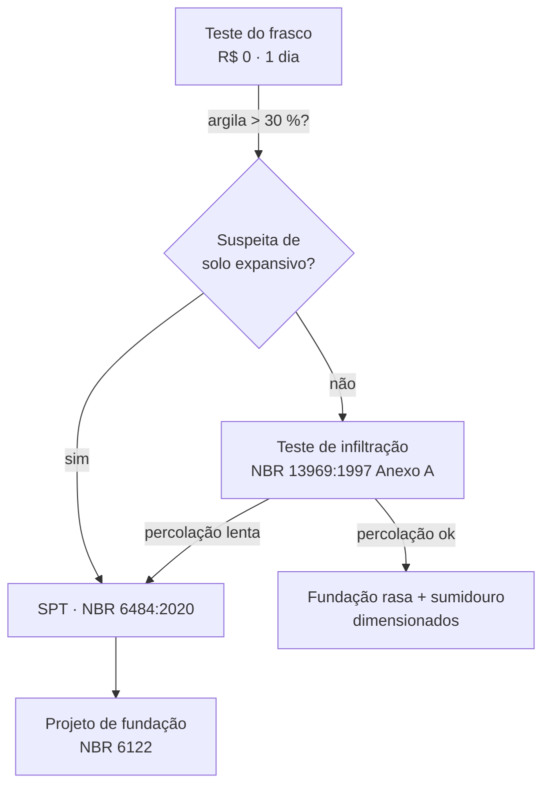

# Triagem do solo — metodologia (lote A)

Este documento é a *especificação executável* dos ensaios que o campo `solo.ensaios`
de `data/terrenos/lote_a.yaml` referencia. Enquanto um ensaio estiver `pendente`, o
projeto trabalha com `classe_presumida` — e o relatório deve dizer isso.

A triagem é em três camadas, da mais barata para a mais cara. Só a terceira é
normativa; as duas primeiras existem para decidir *se e onde* pagar por ela.



## 1. Teste do frasco (jar test) — textura por sedimentação

**Para quê:** estimar as frações areia/silte/argila e, com isso, a aptidão da terra
para taipa (queremos ~50–70 % de areia, 15–30 % de argila, pouco silte) e o risco de
solo expansivo sob a fundação.

**Como:**

1. Colete ~500 g abaixo da camada orgânica (30–50 cm), em 3 pontos do lote.
2. Encha 1/3 de um frasco transparente com a amostra, complete com água, adicione
   uma colher de sal (acelera a floculação da argila) e agite por 2 min.
3. Leia a altura da camada de areia após **1 min**, de silte após **2 h** e de argila
   após **24–48 h**. As proporções são as alturas relativas.

**Registro:** anote as três alturas e a foto do frasco em `engenharia/ensaios/frasco-<ponto>.md`.

**Limites:** é qualitativo. A referência quantitativa é a análise granulométrica de
laboratório (Embrapa, *Manual de Métodos de Análise de Solo*, cap. Análise
granulométrica) — use-a se a decisão de fundação depender do número.

## 2. Teste de infiltração — NBR 13969:1997, Anexo A

**Para quê:** taxa de percolação do solo, que dimensiona sumidouro/vala de
infiltração (esgoto tratado) e indica drenagem para fundação.

**Como (resumo do Anexo A):**

1. Cave uma cova de 30 × 30 cm até a profundidade prevista do sumidouro; forre o
   fundo com 5 cm de brita.
2. Sature: mantenha a cova com água por pelo menos 4 h (solos argilosos: deixe de um
   dia para o outro).
3. Com lâmina de 15 cm, meça o tempo para o nível baixar 1 cm (ou o rebaixamento em
   30 min) até estabilizar. A norma pede **no mínimo três** ensaios.
4. Converta em taxa de percolação (min/cm) e leia o coeficiente de infiltração
   (L/m²·dia) na tabela do Anexo A.

**Registro:** `engenharia/ensaios/infiltracao-<ponto>.md` com a série temporal.

## 3. SPT — NBR 6484:2020

**Para quê:** resistência do solo a cada metro (índice N), perfil estratigráfico,
nível d'água. É o ensaio que a NBR 6122 (fundações) espera como base do projeto.

**Quando:** sempre que houver suspeita de solo mole ou expansivo, mais de um
pavimento, ou fundação diferente de radier/sapata corrida em solo competente.
Contrate empresa que siga a NBR 6484:2020 (martelo, energia e apresentação padronizados)
e peça o boletim com N a cada metro e a cota do NA.

**Registro:** o boletim da sondagem vai em `engenharia/ensaios/spt-<furo>.pdf`
(PDF é entrada bruta aqui, não artefato — versione) e o resumo em Markdown.

## Como isso volta para o YAML

Quando um ensaio for feito, troque `pendente` pelo caminho do registro e preencha os
números derivados:

```yaml
solo:
  classe_presumida: argilo-arenoso
  nivel_agua_m: 4.2
  ensaios:
    frasco: engenharia/ensaios/frasco-p1.md
    infiltracao: engenharia/ensaios/infiltracao-p1.md
    spt: engenharia/ensaios/spt-f1.md
  taxa_percolacao_min_cm: 12
  n_spt_medio_2m: 8
```

Uma regra futura do validador (`soil-tests-required`) pode exigir isso antes de o
build passar — o mecanismo já existe: é só declarar em `perfil_qualidade.yaml`.

## Referências

- ABNT NBR 6484:2020 — *Solo — Sondagem de simples reconhecimento com SPT — Método de ensaio*.
  Resumo público: <https://www.target.com.br/produtos/normas-tecnicas/28006/nbr6484-solo-sondagem-de-simples-reconhecimento-com-spt-metodo-de-ensaio>
- ABNT NBR 13969:1997 — *Tanques sépticos — Unidades de tratamento complementar e disposição
  final dos efluentes líquidos*, Anexo A (ensaio de infiltração). Avaliação crítica do ensaio:
  <https://files.abrhidro.org.br/Eventos/Trabalhos/4/PAP020736.pdf>
- ABNT NBR 6122 — *Projeto e execução de fundações*.
- Embrapa — *Manual de Métodos de Análise de Solo*, análise granulométrica:
  <https://www.infoteca.cnptia.embrapa.br/infoteca/bitstream/doc/1087262/1/Pt1Cap10Analisegranulometrica.pdf>
- Ecocentro IPEC — *Testando a terra para a casa dos seus sonhos* (teste do frasco em campo):
  <https://saracura.org/2017/06/02/1733/>
